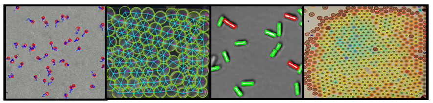

# ParticleTracker

ParticleTracker is a gui based particle tracking software that brings together a range of tools to make particle tracking simple. Full details on installation and use can be found in the documentation:

## Documentation 
[https://particle-tracker.readthedocs.io/en/master/](https://particle-tracker.readthedocs.io/en/master/)

## Video Tutorials
[Youtube Playlist of Tutorials](https://www.youtube.com/playlist?list=PL56zLBbX0yZZw18yyMM9tD0fLrobmdbJG)

## Installation from github
Full details in documentation but in brief:

Download the particletracker.yaml file and then use it to create a new conda environment:

    conda env create -f particletracker.yaml

Alternatively you can install the conda dependencies and then pip install:

    pip install git+https://github.com/mikesmithlabteam/particletracker

Finally, for development purposes, you can also create a new conda environment:

    conda env create -f particlertracker_development.yaml

## To add as a dependency to another pip repository
Add the following argument to setup.py setuptools.setup()

    dependency_links=['https://github.com/MikeSmithLabTeam/particletracker/tarball/repo/master#egg=package-1.0'],

## Citation
To cite this project in your publications please cite the following paper:
"ParticleTracker: a gui based particle tracking software"
M.I. Smith, J.G. Downs, J. Open Source Software 6, 3611 (2021)

Markdown:

    
   
## Contributions
Details about contributing to the ParticleTracker project can be found [here](https://github.com/MikeSmithLabTeam/particletracker/blob/master/CONTRIBUTING.md)

## Licensing
This project is licensed under the terms of the MIT licence (https://github.com/MikeSmithLabTeam/particletracker/blob/master/license.txt).
