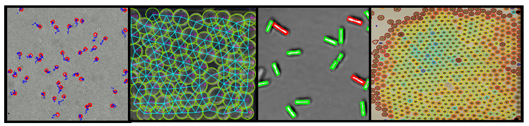

# ParticleTracker

ParticleTracker is a gui based particle tracking software that brings together a range of tools to make particle tracking simple. Full details on installation and use can be found in the documentation:

## Documentation 
[Read the Docs](https://particletracker.readthedocs.io/en/latest/index.html)

## Video Tutorials
[Youtube Playlist of Tutorials](https://www.youtube.com/playlist?list=PL56zLBbX0yZZw18yyMM9tD0fLrobmdbJG)

## Different ways to install

Full details in documentation but in brief:

1. Install to use

    - [Install uv](https://docs.astral.sh/uv/getting-started/installation/)
    - cd to folder
    - uv init
    - uv add git+https://github.com/MikeSmithLabTeam/particletracker
    - uv sync

2. Install to edit underlying code

    - git clone https://github.com/MikeSmithLabTeam/particletracker
    - cd particletracker
    - uv sync --editable .

## Testing
    
If you run the command below then a pre-commit hook is activated which makes sure tests are run.

    - pre-commit install

The github repo is configured to run tests. `ptdev` branch will just report the results, main will reject pushes / merges which don't pass.

## To add as a dependency to another pip repository
Add the following argument to your pyproject.toml

    [project]
    dependencies = [
        "particletracker @ git+https://github.com/MikeSmithLabTeam/particletracker",
    ]

## Citation
To cite this project in your publications please cite the following paper:
"ParticleTracker: a gui based particle tracking software"
M.I. Smith, J.G. Downs, J. Open Source Software 6, 3611 (2021)

Markdown:

    
   
## Contributions
Details about contributing to the ParticleTracker project can be found [here](https://github.com/MikeSmithLabTeam/particletracker/blob/master/CONTRIBUTING.md)

## Licensing
This project is licensed under the terms of the MIT licence (https://github.com/MikeSmithLabTeam/particletracker/blob/master/license.txt).
